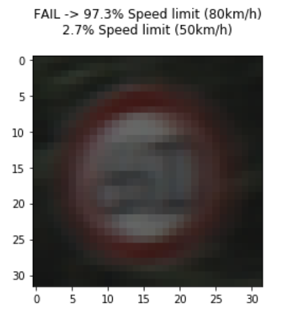

# **Traffic Sign Recognition - Writeup** 

## Project goals

**Build a Traffic Sign Recognition Project**

The goals / steps of this project are the following:
* Load the data set (see below for links to the project data set)
* Explore, summarize and visualize the data set
* Design, train and test a model architecture
* Use the model to make predictions on new images
* Analyze the softmax probabilities of the new images
* Summarize the results with a written report

## Rubric Points

Here I will consider the [rubric points](https://review.udacity.com/#!/rubrics/481/view) individually and describe how I addressed each point in my implementation.  

---

### Files submitted

* [Writeup](README.md) - you're reading it!
* [Project code as Ipython](Traffic_Sign_Classifier.ipynb)
* [Project code as HTML](Traffic_Sign_Classifier.html)

### Data Set Summary & Exploration

#### Statistics

I used simple numpy functions to get a summary of the dataset:

* The size of training set is 34799
* The size of the validation set is 4410
* The size of test set is 12630
* The shape of a traffic sign image is (32, 32, 3)
* The number of unique classes/labels in the data set is 43

I loaded `signnames.csv` into dictionary for nicer display later.

I looked at the distribution over classes in training and validation datasets:

The distribution is not uniform, but that's not a problem by itself. Training and validation sets have similar distribution, so that's good.

#### Image inspection

I also explored the images manually, and noticed couple potential challenges

* Some images are very dark, can't even see by eye. Probably need normalization.

* 32x32 seems too low resolution for some classes (e.g. 100km/h limit)

### Design and Test a Model Architecture

#### Preprocessing

The final preprocessing pipeline was as follows:
1. Convert to grayscale
1. Apply local brightness normalization [CLAHE](https://docs.opencv.org/3.1.0/d5/daf/tutorial_py_histogram_equalization.html) (Contrast Limited Adaptive Histogram Equalization).
1. Normalize to 0 mean and 1.0 standard deviation.

Here is an example of a traffic sign image before and after transformation.

I describe how I came to this pipeline in the "solution approach" section below.

#### Model architecture

I used the exact [LeNet architecture from the class](https://github.com/udacity/CarND-LeNet-Lab/blob/master/LeNet-Lab-Solution.ipynb), because that was the starting point, and it performed well enough.

| Layer         		|     Description	        					| 
|:---------------------:|:---------------------------------------------:| 
| Input         		| 32x32x1 grayscale image   							| 
| Convolution 5x5 + RELU| 1x1 stride, valid padding, outputs 28x28x6 	|
| Max pooling	      	| 2x2 stride,  outputs 14x14x6 				|
| Convolution 5x5 + RELU| 1x1 stride, valid padding, outputs 10x10x16 	|
| Max pooling	      	| 2x2 stride,  outputs 5x5x16 				|
| Fully connected + RELU| outputs 120									|
| Fully connected + RELU| outputs 84									|
| Fully connected + Softmax| outputs 43 (classes)									|
 
#### Model training

Also used the optimizer from the class, which was Adam with learning rate 0.001, and minibatches of 128.

I trained for 50 epochs, after which validation accuracy seemed to converge. Here is a training chart:

#### Solution process

**1. RGB + normalization (93.2%)**

I started with taking LeNet architecture from the class, but changed it to run on RGB images rather than grayscale. Initial assumption was that color should provide more information, because it plays an important role in road signs (e.g. blue vs red). The only preprocessing was image normalization. Training for 50 epochs reached validation accuracy of **93.2%** which was already pretty good. Seems too easy though - need to do better!

**2. Grayscale + normalization (94.1%)**

Next, I tried converting images to grayscale (because it was mentioned a lot), and was surprised to find that it did significantly better: **94.1%** validation accuracy after 50 epochs! LeNet architecture was reverted to 1 input channel - exactly as in the class.

**3. YCbCr + normalization (93.8%)**

I thought, the colour should still provide useful information, so maybe I can put it next to the grayscale. I found that color transformation that does that is called YCbCr, where Y is the grayscale part. Ran LeNet again with 3 channels but the accuracy was still not better than grayscale: **93.8%**. It's a bit weird, because the network has the same information as in grayscale, plus extra information which should be useful. The only explanation is that the extra information leads to overfitting - if so, we need some kind of regularization to deal with it. 

**4. Grayscale + CLAHE normalization (96.8% validation / 95.3% test)**

Next, I looked at the misclassified images to get some insight. I found that in these cases often the problem is the brigtness of the background. Since the image is normalized globally, if the background is bright, the sign turns dark, and the classifier has problems dealing with it. To address this, we could do some kind of "local normalization". I found that OpenCV has something similar called [CLAHE](https://docs.opencv.org/3.1.0/d5/daf/tutorial_py_histogram_equalization.html) (Contrast Limited Adaptive Histogram Equalization). So I just ran with it, and the result was great: **96.8%** validation accuracy!

At this point I decided that the result is good enough, and didn't move on to tweaking the network architecture. If I were to continue, I would definitely try regularization (e.g. dropout).

Taking this as a final solution, I ran it on test set and got **95.3%** accuracy - I'm happy with that!

My final model results were:
* validation set accuracy of 96.8% 
* test set accuracy of 95.3%

#### Misclassification

It is interesting to explore misclassified images. I output the top-k classes (if greater than 0.1%), as suggested in the next part. Some patterns:

* Some images are actually really poor resolution - human wouldn't classify them either
* Sometimes fails on speed limits text recognition. It's understandable - that's quite a challenging problem, maybe just needs some more time to train

 

### Test a Model on New Images

#### Acquiring new images

Here are seven German traffic signs that I found on the web:

I cropped them to be square aspect ratio, so they can fit into the model (after resizing). I also cropped them in a way, that the sign would take a large part of the image. 

The only less trivial case was the last one, where multiple "no stopping" signs are seen. Maybe I was too easy on it, and could have chosen more difficult examples. 

#### Performance on New Images

Here are the results of the prediction:

| Image			        |     Prediction	        					| 
|:---------------------:|:---------------------------------------------:| 
| Speed limit (70 km/h) | Speed limit (70 km/h) | 
| Right-of-way at the next intersection | Right-of-way at the next intersection |
| No entry | No entry |
| Priority road | Priority road |
| Road work | *Bicycles crossing* |
| Stop | Stop |
| No parking | *Speed limit (30 km/h)* |

The model was able to correctly guess 5 of the 7 traffic signs, which gives an accuracy of 71%. This is quite a bit worse than test accuracy, which shows that the new images are not representative of the test set.

#### Model Certainty - Softmax Probabilities

For easier inspection, I made the code which outputs the top 5 probabilities with classes (looked up in `signnames.csv`) as the title of the image. I only output probabilities above 0.1%. I already used the code in the analysis of misclassified images from the validation test, when improving the model.

Here are the outputs for the new images (excluding ones where output is 100% one class):

We can see that the last two images are in fact the ones where the model guessed wrong - it is consistent with the fact that it wasn't "sure" of the output.

For the case of **no parking** sign, I realized that the sign was not even in the training set, so no wonder that the model had no idea (even without the complication of multiple signs in the picture).

For the case of **road work** sign, the correct answer actually showed up, but only with 4.7% probability. I wondered why it would think this is a bicycle crossing, and looked the training set of images in that class. What I found is that many of the bicycle signs are very poor quality because of resolution, where the bicycle is impossible to distinguish:

So perhaps the model has learned that the red triangle with "something unrecognizable" in it is likely a bicycle crossing. This is clearly a problem of the training dataset.

